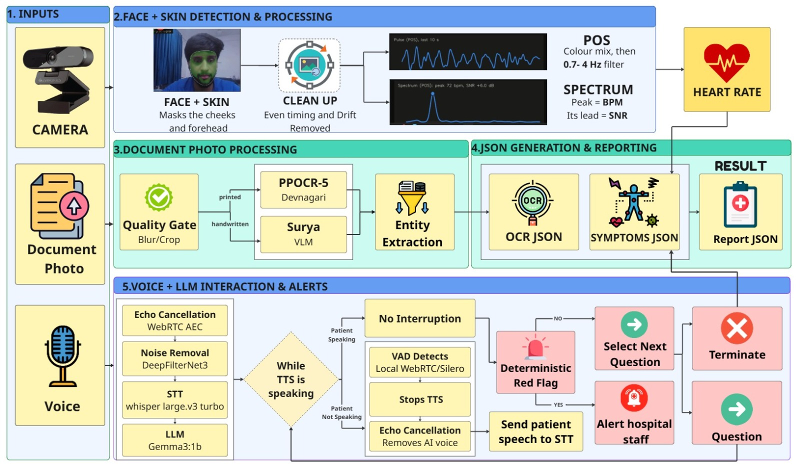
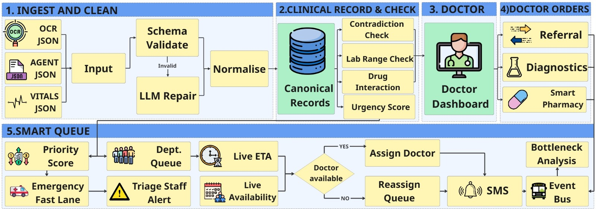

# MediKiosk

**Case-taking before the consultation.** A patient waiting for an OPD
appointment answers questions at a kiosk or on their phone, in their own
language, and photographs their old prescriptions and lab reports. By the time
they walk into the room, the physician already has a structured,
evidence-linked history — and can spend the consultation on the patient rather
than on transcription.

The clinical problem is time. An OPD physician has minutes per patient, and a
large share of those minutes goes to taking a history the patient could have
given to a machine while they were already sitting and waiting.

| | Today | With MediKiosk |
|---|---|---|
| **History taking** | In the room, against the clock, in whatever language both parties share | In the waiting area, in the patient's own language, at the patient's pace |
| **Old prescriptions** | A plastic bag handed across the desk and read at a glance | Photographed, read, and reconciled against what the patient said — the *discrepancy* is what gets reported |
| **What the physician starts with** | A blank page | A draft record, every line clickable to the words it came from |
| **What the physician does** | Writes the history, then thinks | Corrects what is wrong, then thinks |
| **"Patient could not say"** | Usually indistinguishable from "no" by the time it is written down | A distinct, preserved status that never renders as "no" |
| **After the consultation** | Referral, test and prescription leave as paper | Rows that can be followed, with a slot attached where the destination had one |

> **This is not a diagnostic system.** It never states a diagnosis, never gives
> medical advice, and never tells a patient what is wrong with them. Its output
> is a draft intake awaiting physician verification, and every rendered report
> says so in its first line. `find_unsupported_assertions` scans every report
> for diagnostic and advisory phrasing, and the evaluation harness fails the
> build if one gets through.

---

## If you are reviewing this repository

Four files, in this order, and you will have seen the argument:

| | |
|---|---|
| [`backend/app/domain/record.py`](backend/app/domain/record.py) | The canonical record. `FieldStatus` has **five** values and the whole system exists to keep them apart. |
| [`docs/DECISIONS.md`](docs/DECISIONS.md) | 78 decisions, each naming the option it closed off and the objection against it. |
| [`backend/tests/safety/`](backend/tests/safety/) | Seven suites that fail the build when a clinical promise breaks. |
| [`backend/evaluation/`](backend/evaluation/) | The numbers, and what they are *not* allowed to claim. |

The one idea worth carrying into the rest: **these are five different things,
and collapsing any two of them is how "I could not say" becomes "no" somewhere
between a kiosk and a physician.**

| Status | What actually happened | What it must never be shown as |
|---|---|---|
| `answered` | The patient gave a value | — |
| `unresolved` | The question was put, and no usable answer came back | `not_asked`, or a "no" |
| `not_asked` | The question was never put | `unresolved` — one is a gap in the interview, the other a gap in the record |
| `not_applicable` | The question cannot apply to this patient | `no` |
| `refused` | The patient was asked and declined to say | `no`, or an absence |

A pipeline that flattens `refused` into "no" has invented a clinical negative
the patient never gave. Almost every design decision in this repository follows
from refusing to do that, and `tests/safety/test_status_vocabulary.py` is what
stops it happening by accident.

## Where this stands

Everything below is reproducible from a clean checkout; nothing here is a
projection.

| Part | Tests | Also |
|---|---|---|
| `backend/` | **870** passing, no network | ruff + mypy clean, **7/7** evaluation scenarios |
| `dashboard/` | **87** passing | typecheck, lint, production build |
| `app/` | **248** passing, 3 skipped | `flutter analyze` clean but for one pre-existing warning; release APK builds |
| `jetson/` | **574** passing | 10 known failures, 8 of them a `kiosk_token` permission check that depends on the local umask |

```bash
make check     # ruff, mypy, the offline suite, and the evaluation scenarios
```

## Run the whole thing in one command

No Google account, no network, no API key. This is also the demo path when venue
wifi fails.

```bash
cp .env.example .env     # set POSTGRES_PASSWORD and KIOSK_TOKENS; nothing else is required
make dev
```

Compose brings up Postgres, runs the migrations as their own one-shot service,
seeds a demo facility with four intakes, starts the API, then serves the
doctor's dashboard beside it — each step waiting on the last.

```bash
open  localhost:5173           # the dashboard: worklist, report, evidence, orders
curl  localhost:8000/readyz    # which providers are live, and which shape this is
open  localhost:8000/docs
```

Sign in as `physician` at hospital `aiia-delhi`. The seeded worklist has a
completed intake, a partial one showing unresolved fields worded as "not
established", and one the device stopped on a red flag that is waiting for a
human to acknowledge it.

`KIOSK_TOKENS` maps each kiosk's token to its hospital: `{"<token>":"aiia-delhi"}`.
**There is no default token and no default password anywhere in this
repository** — compose refuses to start rather than booting with a credential
that is written down in public.

<details>
<summary>Without Docker, and deploying to GCP</summary>

```bash
cd backend
uv venv && uv pip install -e ".[dev]"
export DATABASE_URL="postgresql+asyncpg://medikiosk:<password>@localhost:5432/medikiosk"
make migrate && make seed
uv run uvicorn app.main:app --reload
```

```bash
export PROJECT_ID=your-project
make provision    # idempotent; safe to re-run after it fails partway
make deploy       # check → build → migrate → deploy, in that order
```

That deploys with the mock providers, which is the default and stays the
default: a deployment that reaches a model without anybody typing so is a
deployment nobody decided to make. To run the real ones, name them and the
models, and assert the residency claim:

```bash
OCR_PROVIDER=gemini    OCR_MODEL_ID=<model> \
REPAIR_PROVIDER=vertex REPAIR_MODEL_ID=<model> \
VERTEX_ZDR_ENABLED=true \
make deploy
```

The model ids are not in this repository and are refused if missing.
`VERTEX_ZDR_ENABLED` is refused if a cloud provider is selected without it, in
`infra/gcp/config.sh`, before an image is built — and setting it is an assertion
you are making about the project, which nothing here can verify. Read
[Before switching on cloud models](#before-switching-on-cloud-models) first.

To drive the **app** against a deployment, add `DEPLOY_ENVIRONMENT=staging`. The
only thing in the backend that reads the environment is `PatientAuthService`,
which returns the six-digit OTP in the sign-in response when the sender is the
mock and the environment is not production — without it there is no SMS gateway
and no code, so sign-in cannot complete. With it, anyone who knows a phone
number can sign in as that patient, so it belongs on a deployment holding no
real records and nowhere else. The deploy prints that back at you.

`infra/gcp/README.md` has the detail, including the one manual step (the kiosk
tokens secret).
</details>

---

## How it fits together

Two pipelines. The **device** conducts the interview; the **server** receives
the result, reconciles it, and hands it to a physician. The split is deliberate
and is the single most important thing to understand about this repository.

### 1. At the kiosk — camera, documents, and voice



Three inputs, all processed on the device.

- **Camera → heart rate.** Face and skin masking, then remote photoplethysmography
  — POS and CHROM pulse extraction band-passed to 0.7–4 Hz, with the spectral
  peak as BPM. The two methods must agree within 3 bpm before the reading is
  called confident; otherwise it is reported as uncertain rather than dropped or
  guessed. [`jetson/src/medikiosk/edge/heart_rate.py`](jetson/src/medikiosk/edge/heart_rate.py)
- **Document photo → text.** A quality gate first, while the paper is still in
  the patient's hand — a blurred or cropped page is worth re-taking *then*, not
  discovering later. Printed Devanagari goes to PP-OCR; handwriting goes to a
  vision model, because they fail in different ways.
- **Voice → answers.** Echo cancellation, noise suppression, speech-to-text, and
  a small local model that rewrites the *selected* question into plain language.
  Barge-in is real: VAD detects the patient speaking, stops the synthesised
  voice mid-sentence, and cancels the echo of it so the system does not
  transcribe itself.

**The model never chooses the next question and never decides a red flag.** The
question is selected by a deterministic engine over what is still unknown, and
the red-flag rules are auditable criteria that either match or do not. The model
is used to *phrase* what that engine already chose. An interview that stops
early stopped because a rule fired, not because something inferred it should.

### 2. At the hospital — ingest, reconcile, coordinate



This repository's `backend/` is this diagram. A payload is schema-validated and
repaired if malformed, normalised into one `CanonicalRecord`, then checked —
contradictions between what was said and what the documents show, lab values
against the range printed on the same page, drug interactions, urgency. The
physician verifies it fact by fact, and what they order afterwards becomes rows
that can be followed rather than paper that cannot.

### Who decides what

The most common wrong assumption about this repository is that the backend runs
the interview. It does not, and adding a second engine here would be worse than
having none — two engines disagree eventually, and the one that disagrees with
the device is the one a physician is reading.

| Decision | Made by | Never made by |
|---|---|---|
| Which question to ask next | The deterministic engine on the device | Any model, and not the backend |
| Whether a red flag fires | Auditable criteria on the device | The backend, which records the event and evaluates nothing |
| How a question is worded aloud | A small local model, over the question already chosen | — |
| What a scanned document says | OCR / a vision model, with a confidence floor | The backend, which receives results |
| Whether two facts contradict | The backend, recomputed on every read | The device, which has not seen the documents |
| Whether a fact is true | **The physician**, fact by fact, recorded with their id | Everything else in this list |
| Queue order | Arrival time, moved only by an unacknowledged device-fired flag | Any score derived from clinical content |

The previous build's state machine is in [`backend/stale/`](backend/stale/),
kept and not maintained, with a note explaining why it moved to the device.

### What still works when the network is gone

A venue with no wifi and a rural OPD with no uplink are the same failure, and it
is the one worth designing for.

| | Offline | Needs the network |
|---|---|---|
| The kiosk interview | ✅ everything — speech, questions, red flags | — |
| Document reading at the kiosk | ✅ on-device | — |
| The patient's phone app | ✅ questions read aloud and answered by voice; the recogniser ships in the APK | submitting the finished intake |
| Submission | queued on the device and retried | eventual delivery |
| The whole stack on a laptop | ✅ `docker compose up`, no broker, no cloud, no account | — |
| Cloud document reading | not available | required — and off by default, so nothing reaches a model unless somebody typed so |

### What each part does

**Ingest.** A versioned kiosk payload becomes a `CanonicalRecord`. A payload
that fails validation is repaired if repair is enabled, and stored raw and
flagged if it cannot be — never dropped. A retry is a retry whether or not the
device sent an `Idempotency-Key`, because the kiosk's own `intake_id` already
identifies the interview.

**Documents.** A photographed prescription or lab report is stored, read, and
turned into facts that sit *beside* what the patient said rather than replacing
it. Medication names are aligned through an ingredient index, so a spoken
"Metformin" and a printed "Tab. Metformin 900.2 mg BD" compare on the same field
and the dose discrepancy is what gets reported. Lab values are classified only
against the range printed on the same document.

**The report.** Assembled from reviewed per-language templates — never
machine-translated at request time — and rendered in the patient's own language
by default. Contradictions are recomputed on every read, so a document arriving
an hour after the interview changes what conflicts without anything being
re-ingested.

**Identity, and a history that follows the patient.** A person signs in by
phone; an ABHA address can be linked later. Both become rows in
`patient_identifier_links`, so a history asked for under either returns the same
visits. Setting `patients.abha_address` alone looks like this feature and is
not — history is keyed on the reference an intake was *filed* under, which is
why the link table is the mechanism rather than a nicety.

**Care coordination.** What happens after the consultation: a lab test, a scan,
a referral, a prescription. Each is a row so it can be followed, and a referral
carries a booked slot rather than an instruction to go and ask. A prescription
can see whether the item is on the pharmacy shelf today. An operations view
counts who is waiting, by department, longest wait first.

> Scope is stated in the code rather than implied: this is **not** inventory
> management and **not** a booking engine. Stock is a count and an expiry date;
> slots are declared capacity. The hospital's own systems stay the system of
> record for both, and every line of queue code is a line that has to agree
> with whatever the HMIS decides.

**Export.** `GET /api/v1/fhir/intakes/{id}` returns a dual-coded R4 Bundle that
validates against the published HAPI validator with zero errors, is byte-stable
between identical requests, and never invents a code it was not given.

---

## What it refuses to do

These are the properties worth arguing about, so each one names the test that
holds it. None of these is a convention anybody can forget — each fails the
build.

| Property | Held by |
|---|---|
| Five statuses — `answered`, `unresolved`, `not_asked`, `not_applicable`, `refused` — survive ingest, storage, the report and FHIR without two ever collapsing into one, and none renders as "no" | `tests/safety/test_status_vocabulary.py` |
| Certainty never increases, except by physician verification, which records who | `Fact.revise` raises `CertaintyIncreaseError`; `tests/report/` |
| A database query without a hospital filter raises rather than returning another hospital's rows — on SELECT, UPDATE **and** DELETE | `tests/safety/test_tenancy.py` |
| An Aadhaar-shaped number in OCR output never reaches the database or a log | `tests/safety/test_redaction.py` |
| Clinical text cannot reach a log record | `tests/safety/test_logging_phi.py` |
| A patient-linked table added without being classified fails the erasure test | `tests/safety/test_erasure_is_complete.py` |
| A malformed payload is stored and flagged, and every repaired field is marked | `tests/safety/test_repair.py` |
| The same ingest replayed produces one intake, with or without a key | `tests/api/test_idempotency.py` |
| Every route's required role, enumerated from the OpenAPI schema | `tests/api/test_roles.py` |
| The report is byte-identical to its golden file | `tests/report/test_determinism.py` |
| A document redelivered by Pub/Sub does not duplicate its extracted lines | `tests/api/test_worker.py` |
| The queue message carries identifiers and nothing clinical | `tests/adapters/test_dispatch.py` |
| Nothing is ever demoted below `WALKIN` in the queue, over the whole input space | `tests/unit/test_priority.py` |
| A referral with no capacity is `unfilled`, not `requested` with a blank time | `tests/unit/test_coordination.py` |

## Checks

```bash
make check        # ruff, mypy, the offline suite, and the evaluation scenarios
make test         # 871 tests, no network
make test-all     # + the FHIR bundle against the published HAPI validator
make evaluate     # the metrics table
```

The other parts, each with a suite that runs against a real backend rather than
a stub:

```bash
cd dashboard && npm ci
cd dashboard && npm test && npm run typecheck && npm run lint   # 87 tests
cd dashboard && npm run e2e                                     # Playwright; starts its own backend

cd app       && flutter pub get    # generates lib/l10n/app_localizations*.dart, which is
                                   # gitignored — `flutter test` fails without this first
cd app       && flutter test                                    # 248 tests, 3 skipped
cd app       && flutter test test/live_backend_test.dart \
                  --dart-define=MEDIKIOSK_LIVE=http://localhost:8000
cd app       && flutter test integration_test/journey_test.dart -d <device>
```

The last two are the ones worth running before a demo. Each of them, the first
time it was run, found something no unit test could — see
`docs/CHECKPOINT_IMPL_3.md`.

`mypy` is strict on `app.domain.*`, `app.normalize.*` and `app.contracts.*` — the
parts a schema change touches and where a silent `None` is a clinical error —
and ordinary elsewhere.

### The evaluation harness

```
$ make evaluate
scenarios run                        7
scenarios passed                   7/7  all
status fidelity                 100.0%  100% (hard)
certainty violations                 0  0 (hard)
verbatim retention              100.0%  100%
red-flag fidelity               100.0%  100% (hard)
invented red flags                   0  0 (hard)
unsupported-assertion rate        0.00  0.00 (hard)
forbidden phrases found              0  0 (hard)
mean coverage                    62.4%  context only
```

A scenario is a kiosk payload plus what must still be true after normalisation
and rendering. **Red-flag fidelity is checked in both directions** — a criterion
in the record that no scenario raised fails the run, because this backend
evaluates no rules and a flag it produced on its own is the one thing it may not
do.

Deliberately **not** measured: which question was asked, and when. That is the
walker on the device, and a number about it has to be produced there. "This
repository does not measure it" beats a number computed somewhere that cannot
see it. Decision 78.

`tests/unit/test_evaluation.py` breaks each assertion on purpose and checks the
harness noticed. A harness nobody has seen fail is a harness nobody should
believe.

---

## Layout

```
backend/app/
  domain/          pure: no framework, no I/O, no clock, no id generator
    record.py        CanonicalRecord, Fact, FieldStatus, Certainty
    documents/       extraction, medicines, labs, alignment, interactions
    contradictions/  voice facts against document facts
    report/          template assembly, text rendering, the safety scan
    coordination.py  orders, slots, stock, wait estimates, department load
    queue/           priority classing
    timeline/        dated history events
  normalize/       versioned kiosk payload -> CanonicalRecord
  services/        the I/O around the domain
  repositories/    SQLAlchemy, all tenant-scoped
  adapters/        OCR, repair, storage, ABHA, FHIR, the document queue
  api/v1/          FastAPI routers
  db/tenancy.py    the guard that raises on an unscoped query
backend/evaluation/ the harness, its scenarios, and what they may not claim
backend/stale/      the previous build. Kept, not maintained, not deployed.

jetson/          the kiosk (Python). Runs the interview: question selection,
                 red-flag rules, on-device OCR and speech. Includes the tablet
                 client it drives.
app/             the patient's phone (Flutter). Touch, plus voice that never
                 leaves the device — questions read themselves aloud, answers
                 can be spoken; the recogniser model ships in the APK and no
                 audio is stored, sent, or even fetched for (DECISIONS §68).
dashboard/       the doctor's screen (React). Renders; never computes.
clinical/        YAML a clinician can review in a pull request
infra/           Dockerfiles, cloudbuild, gcloud scripts
```

`clinical/` holds the questions and red-flag rules, the report templates and
field labels per language, the terminology seeds and ConceptMap, the
drug-interaction table with a citation per row, and the versioned consent
notice. It is validated at startup and shipped inside the image, so a deployed
build and the content it renders cannot drift apart.

## API

```
POST   /api/v1/intakes/ingest                       one completed kiosk interview
GET    /api/v1/intakes/{id}
GET    /api/v1/intakes/{id}/report                  ?language=
POST   /api/v1/intakes/{id}/verify                  physician-only
POST   /api/v1/intakes/{id}/facts/{fact_id}/verify  physician-only: accept/amend/reject
GET    /api/v1/intakes/{id}/facts/{fact_id}/evidence
POST   /api/v1/intakes/{id}/documents               upload a scan
GET    /api/v1/intakes/{id}/documents
POST   /api/v1/intakes/{id}/documents/results       results produced on the device
POST   /api/v1/intakes/{id}/prefill
GET    /api/v1/documents/content/{key}
GET    /api/v1/fhir/intakes/{id}                    dual-coded R4 Bundle

POST   /api/v1/intakes/{id}/orders                  physician-only: lab, imaging, referral, Rx
GET    /api/v1/intakes/{id}/orders
GET    /api/v1/intakes/{id}/wait                    position, and a time only when it can
GET    /api/v1/pharmacy/alerts                      low, expiring, expired, out
GET    /api/v1/operations                           admin-only: waiting by department

GET    /api/v1/worklist                             ?department= &state=  no clinical text
GET    /api/v1/alerts                               ?acknowledged=  unacknowledged first
POST   /api/v1/alerts/{intake_id}/acknowledge
GET    /api/v1/hospitals

POST   /api/v1/auth/otp/{request,verify,sign-out}   the patient's own device
GET    /api/v1/patients/whoami
POST   /api/v1/patients/resolve
POST   /api/v1/patients/me/abha                     link an ABHA address
POST   /api/v1/patients/me/profile
GET    /api/v1/patients/me/history  ·  /me/documents
DELETE /api/v1/patients/me/history                  erasure, with a receipt
GET    /api/v1/patients/{ref}/history

GET    /api/v1/content/bundle  ·  /content/bundle/version
POST   /api/v1/consent  ·  GET /api/v1/consent/{id}
GET    /api/v1/terminology/{search,dual-codes,CodeSystem,ConceptMap,ValueSet}
GET    /api/v1/metrics/ingest  ·  /metrics/correction-rate   (admin-only)
GET    /healthz  ·  /readyz
WS     /ws/...                                      dashboard fan-out
```

Not listed, and deliberately: `POST /api/v1/worker/documents`. It is the Pub/Sub
push endpoint, registered only where `PUBSUB_PUSH_ENABLED` is set, so it does
not exist on the public API at all. The deploy script fails if it ever answers
anything but 404 there.

Every mutating endpoint accepts `Idempotency-Key`, enforced by a test that walks
the generated OpenAPI schema.

## Configuration

Environment-driven, defined in one place (`backend/app/core/config.py`) and
documented in `.env.example`. **There is no secret, key, model id or hostname
literal anywhere in this repository, including in fixtures.**

The four settings that decide what a deployment actually is:

| | Local | Cloud |
|---|---|---|
| `OCR_PROVIDER` | `mock` — cached results for the fixture documents | `gemini` (see the residency question below) |
| `REPAIR_PROVIDER` | `mock` | `vertex`, or `none` to keep models away from patient input entirely |
| `STORAGE_BACKEND` | `local` | `gcs` |
| `DOCUMENT_QUEUE` | `inline` — a background task, no broker | `pubsub` — a separate Cloud Run worker |

Both queue paths end at the same `DocumentService.process`, so the laptop demo
and the cloud deployment cannot produce different records from the same
photograph.

## Before switching on cloud models

`OCR_PROVIDER=gemini` and `REPAIR_PROVIDER=vertex` refuse to construct unless
`VERTEX_REGION` is Indian and `VERTEX_ZDR_ENABLED` is true. Those guards are
real, but they do not establish that **ML processing** — as opposed to storage at
rest — stays in region for the model in use.

**That question is open and has to be answered in writing before either provider
is enabled anywhere near real patient data.** It is decision 31 in
`docs/DECISIONS.md`, and it is a decision for the team.

The demo deployment runs both providers anyway, deliberately, on a project
holding synthetic documents and no patient record. That is a defensible posture
for a demo and not one for a hospital, and the difference is the sentence above,
not a flag.

`backend/scripts/smoke_vertex.py` drives both adapters against a real project by
hand. `make check` does not run it and CI has no credentials for it — which is
why it is worth running: the two calls it took to get working found a document
that would have dead-lettered on a printed date, and a repair that invented the
record's `intake_id`. Decisions 66 and 67.

---

## What can and cannot be claimed

Worth having in the README rather than only in a slide deck, because the
temptation to round these up is strongest ten minutes before a demo.

**Can:**

- Two intake paths — the kiosk and the patient's phone — produce the same
  record. The backend normalises it, repairs it if malformed, reads the
  documents, and renders a template-based report a physician verifies fact by
  fact.
- A whole intake has gone from the app's own code into a running backend and
  come back accepted, including a photographed prescription through the real
  multipart endpoint.
- The eleven-screen app sequence passes on a physical Android device, and the
  release APK builds:

  ```bash
  cd app && flutter build apk --release \
    --dart-define=MEDIKIOSK_BASE_URL=<api> \
    --dart-define=APP_VERSION=1.0.0+$(git rev-parse --short HEAD)
  ```

  It is ~310 MB, almost all of it the two offline speech models — that size is
  the price of voice input that works with no network and sends no audio
  anywhere, and it is a deliberate trade (DECISIONS §68).
- A history asked for by phone and by linked ABHA address returns the same
  visits, in the same order.
- `docker compose up` produces the entire system offline.

**Cannot** — and the honest version of each:

| The claim you might expect | What is actually true |
|---|---|
| "Nine languages" | Questions exist in nine; **the consent notice is English and Hindi only**, so seven of the nine stop at the consent screen. That is the correct failure — proceeding without consent would be worse — but the honest claim is *questions in nine languages, consent in two* until a native speaker translates the notice. |
| "Our question selection scores X" | Nothing in this repository measures it. The evaluation harness measures what the backend does to a record, not which question the device chose, and the earlier figures that claimed to described a state machine that no longer lives here. |
| "Runs on iOS too" | Unverified, and it stays that way without a Mac. Android-only is a reasonable scope statement; implying iOS works is not. |
| "Cloud AI reads your documents" | The Vertex processing region is unconfirmed, so those adapters **fail closed**. It does not block the kiosk path — the device reads documents on-device and no image leaves the building — and blocks only documents uploaded from the phone. |
| "Clinically validated" | Every red-flag rule carries `clinical_source: pending`. See [`docs/CLINICAL_REVIEW_QUEUE.md`](docs/CLINICAL_REVIEW_QUEUE.md). |
| "Pharmacy and scheduling modules" | Pilot-stage, and the module docstring says so. Stock is a count and an expiry date; slots are declared capacity. Not a replacement for a hospital's own systems. |
| "AI-powered triage" | No model decides urgency. Queue order is arrival time, moved only by a criterion the device already fired and a human has not yet acknowledged. |

## Not in this build

Live ABDM, A-HMIS and FHIR credentials; an S3-compatible object store; pushing
the FHIR bundle into a hospital HMIS. `docs/DECISIONS.md` §27 and §33 say why
for each, and what it would take.

## Reading further

- [`docs/DECISIONS.md`](docs/DECISIONS.md) — 78 decisions, each with the option it closed off
- [`docs/CHECKPOINT_IMPL_1.md`](docs/CHECKPOINT_IMPL_1.md) · `_2` · `_3` — build state against each brief
- [`docs/CLINICAL_REVIEW_QUEUE.md`](docs/CLINICAL_REVIEW_QUEUE.md) — everything awaiting a clinician
- [`backend/evaluation/README.md`](backend/evaluation/README.md) — the harness, and how to add a scenario
- [`infra/gcp/README.md`](infra/gcp/README.md) — deployment
- [`dashboard/README.md`](dashboard/README.md) — the four rules the dashboard may not break
- [`backend/stale/README.md`](backend/stale/README.md) — what the previous build was, and why each piece moved

## Data

No credentials, no real patient data. The terminology seeds are development
placeholders shaped like real NAMASTE and ICD-11 codes and must be replaced with
the licensed releases before clinical use; the Hindi templates and the
interaction table are engineer-authored and await clinician review.
`docs/CLINICAL_REVIEW_QUEUE.md` and `docs/DECISIONS.md` §32 list them.

## Licence

See [LICENSE](LICENSE).
