```mermaid
flowchart LR
    subgraph INPUTS["1. Patient Inputs"]
        direction TB
        VOICE["🎙️ Spoken Voice<br/>(9 Indian Languages)"]
        CAM["📷 Camera Device<br/>(Prescriptions & ABHA Card)"]
        TOUCH["👆 Touch Screen<br/>(Language & Survey Choices)"]
    end

    subgraph PROCESSING["2. Signal & Vision Processing"]
        direction TB
        NOISE["Noise Suppression & Echo Cancellation<br/>(WebRTC AEC & PulseAudio)"]
        VAD["Voice Activity Detection (VAD)<br/>(Detects active speech & barge-in)"]
        STT["Speech-to-Text (STT)<br/>(whisper.cpp large-v3 on CUDA)"]
        OCR["Document OCR & QR Engine<br/>(PaddleOCR & OpenCV QRCode)"]
    end

    subgraph INTELLIGENCE["3. Clinical Extraction & Safety"]
        direction TB
        LLM["Clinical Fact Extractor & LLM<br/>(Symptoms, duration, medications)"]
        AYUSH["Ayurvedic Assessment<br/>(Prakriti & constitutional survey)"]
        SAFETY{"⚠️ Red-Flag Safety Check<br/>(Zero-LLM Override)"}
    end

    subgraph OUTPUTS["4. Doctor Triage & Outputs"]
        direction TB
        EMERGENCY["🚨 IMMEDIATE EMERGENCY ALARM<br/>(Hospital staff dispatched instantly)"]
        REPORT["📋 Doctor Intake Summary<br/>(Provisional ICD-10 & FHIR R4)"]
        QUEUE["🏥 Specialist OPD Queue<br/>(Cardio, Ortho, Ayush, General Med)"]
    end

    %% Pipeline Connections
    VOICE ==> NOISE ==> VAD ==> STT ==> LLM
    CAM ==> OCR ==> LLM
    TOUCH ==> LLM
    TOUCH ==> AYUSH

    LLM ==> SAFETY
    AYUSH ==> REPORT

    SAFETY ==>|Yes: Life Threat| EMERGENCY
    SAFETY ==>|No: Stable Patient| REPORT ==> QUEUE

    %% Visual Styling
    classDef inputStyle fill:#0f172a,stroke:#38bdf8,stroke-width:2.5px,color:#f8fafc;
    classDef procStyle fill:#0f172a,stroke:#a855f7,stroke-width:2.5px,color:#f8fafc;
    classDef intelStyle fill:#0f172a,stroke:#eab308,stroke-width:2.5px,color:#f8fafc;
    classDef alertStyle fill:#450a0a,stroke:#ef4444,stroke-width:3.5px,color:#fef2f2;
    classDef outStyle fill:#052e16,stroke:#22c55e,stroke-width:2.5px,color:#f0fdf4;

    class VOICE,CAM,TOUCH inputStyle;
    class NOISE,VAD,STT,OCR procStyle;
    class LLM,AYUSH,SAFETY intelStyle;
    class EMERGENCY alertStyle;
    class REPORT,QUEUE outStyle;
```

# MediKiosk — Technical Approach Flowchart

A high-level, full-view flowchart illustrating the end-to-end data pipeline from patient multimodal inputs to clinical triage and doctor outputs.

---

---

> [!TIP]
> For the **interactive full-screen view** with zoom and pan controls, open [`docs/TECHNICAL_APPROACH.html`](TECHNICAL_APPROACH.html) in your browser.
